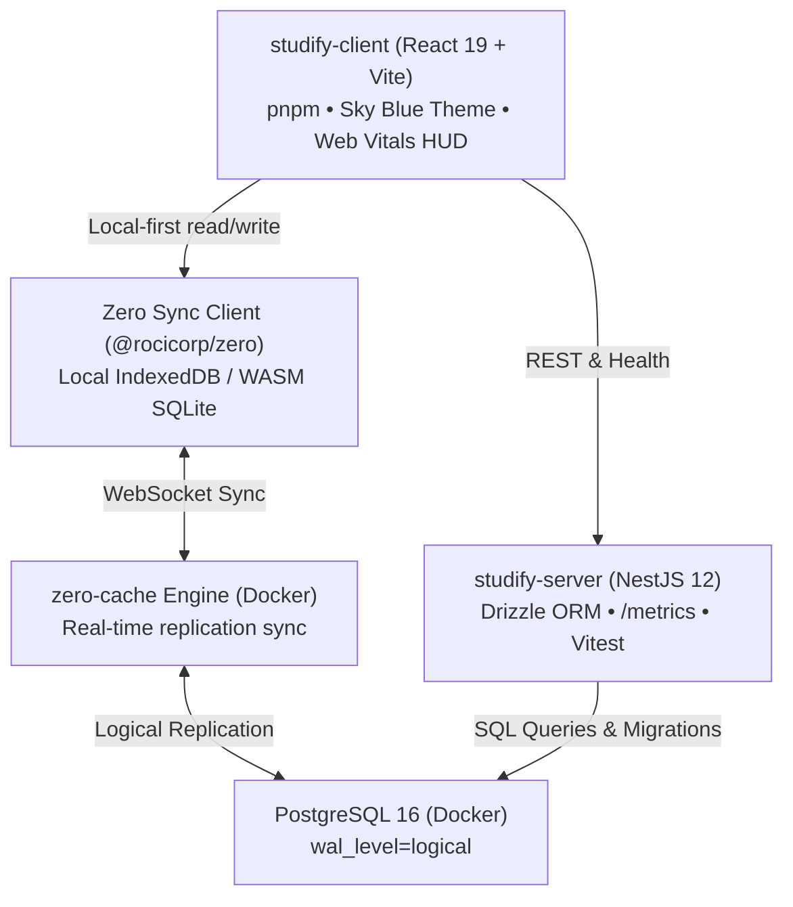

# 📖 Studify

> A fast, keyboard-first study companion designed for frictionless entry of definitions, concise notes, comparisons, and core concepts. Features real-time local-first sync with **Rocicorp Zero**, a type-safe **NestJS + Drizzle ORM** backend, and a sky-blue themed **React 19** frontend.

---

## 🌟 Key Features

- **⚡ Centered Smart Input Bar**: Rapid note entry with inline tag syntax (e.g. `Closures capture outer variables #javascript #web #frontend`).
- **🏷️ Quick-Toggle Tag Pills**: One-click tags toggleable below the input bar before or after typing.
- **🔍 Multi-Tag Study View**: Filter notes by one or more tags (e.g. `#frontend` + `#react`) with clear visual badges for definitions, comparisons, and notes.
- **☁️ Sky Blue Aesthetic**: Tailored color system inspired by clear skies with light (morning sky) and dark (twilight sky) modes, crafted following Anthropic's `frontend-design` principles.
- **🔄 Instant Local-First Sync**: Powered by **Rocicorp Zero (`@rocicorp/zero`)** with PostgreSQL logical replication and client-side WASM SQLite / IndexedDB for 0ms perceived latency.
- **📊 In-App Observability**: Toggleable Developer HUD measuring Google Core Web Vitals (`web-vitals`) in real time, plus a NestJS `/metrics` endpoint with latency percentiles (`p50`, `p95`, `p99`) and `Server-Timing` headers.
- **🧪 Comprehensive Testing & CI/CD**: Unit tests with **Vitest** (frontend & backend), E2E tests with **Playwright**, and continuous integration with **GitHub Actions**.

---

## 🏗️ System Architecture



---

## 📚 Study & Learning Guides (Read As You Build!)

Every tool and architectural pattern in Studify is documented with a dedicated educational deep-dive:

1. 📦 [01 — Understanding pnpm, pnpm dlx, and pnpm approve-builds](docs/learning/01-pnpm-and-tooling.md)
2. 🐳 [02 — Docker, Containerization & PostgreSQL Logical Replication](docs/learning/02-docker-and-postgres.md)
3. 🦅 [03 — NestJS Architecture & Drizzle ORM](docs/learning/03-drizzle-orm-and-nestjs.md)
4. 🔄 [04 — Local-First Architecture & Rocicorp Zero Sync](docs/learning/04-zero-sync-architecture.md)
5. 📊 [05 — Performance Engineering: Backend Metrics & Frontend Web Vitals](docs/learning/05-performance-metrics.md)
6. 🎨 [06 — Intentional Frontend Design & Core Web Vitals](docs/learning/06-frontend-design-and-web-vitals.md)
7. 🧪 [07 — Testing Strategies & GitHub Actions CI/CD](docs/learning/07-testing-and-cicd.md)
8. 🌊 [08 — Tailwind CSS v4 Architecture & Modern Utility Styling](docs/learning/08-tailwindcss-v4-architecture.md)
9. 🏛️ [Complete System Architecture & Specifications](docs/architecture.md)

---

## 📜 Development Milestone History Logs

- [Phase 1: Environment, Tooling & Foundation Setup](docs/phases/phase-01-setup.md)
- [Phase 2: Backend Scaffold, Docker & Database Setup](docs/phases/phase-02-backend-and-db.md)
- [Phase 3: Backend Business Logic, Observability & Real-Time Sync](docs/phases/phase-03-backend-features.md)
- [Phase 4: Frontend UI, Sky-Blue Aesthetic & Web Vitals Dev HUD](docs/phases/phase-04-frontend.md)
- [Phase 5: End-to-End Testing & Automated CI/CD Pipeline](docs/phases/phase-05-testing-and-cicd.md)

---

## 📁 Repository Structure

```text
studify/
├── .agents/
│   └── skills/
│       └── frontend-design/      # Anthropic UI aesthetic guidance skill
├── .github/
│   └── workflows/
│       └── ci.yml                # Automated CI pipeline for lint, test, build
├── docs/
│   ├── architecture.md           # Full system specifications & schema
│   ├── learning/                 # 7 educational study guides
│   └── phases/                   # 5 milestone history logs
├── studify-client/               # React 19 + Vite + TypeScript frontend
│   ├── src/
│   │   ├── components/           # SmartInputBar, NoteCard, TagFilters, PerformanceHud
│   │   ├── hooks/                # useWebVitals
│   │   ├── services/             # api.ts (with offline local-first fallback)
│   │   ├── App.tsx               # Main application container
│   │   └── index.css             # Sky Blue CSS token design system
│   └── e2e/                      # Playwright end-to-end tests
├── studify-server/               # NestJS 12 backend
│   ├── src/
│   │   ├── db/                   # Drizzle ORM schema, relations & module
│   │   ├── notes/                # Notes & Tags service, controller, DTOs
│   │   ├── metrics/              # Performance interceptor & /metrics endpoint
│   │   └── main.ts               # NestJS entrypoint with CORS
│   └── drizzle/                  # Generated SQL migrations
├── docker-compose.yml            # PostgreSQL 16 (wal_level=logical) & zero-cache
└── README.md                     # Project documentation
```

---

## 🛠️ Quickstart

### Prerequisites
- **Node.js**: v20+ (tested on v24)
- **pnpm**: v12+ (`npm install -g pnpm`)
- **Docker**: Docker Desktop or Docker Engine

### 1. Start Database & Real-Time Sync Services
```bash
docker compose up -d
```

### 2. Start NestJS Backend
```bash
cd studify-server
pnpm install
pnpm db:generate    # Generate Drizzle migrations
pnpm db:push        # Push schema to PostgreSQL
pnpm start:dev      # Run NestJS API on http://localhost:3000
```

### 3. Start Frontend Client
```bash
cd studify-client
pnpm install
pnpm dev            # Open http://localhost:5173
```

### 4. Browse Database with pgAdmin 4 (Web GUI)
Open [http://localhost:5050](http://localhost:5050) in your browser:
- **Email**: `admin@studify.com`
- **Password**: `admin`
- **Database Password**: `studify_secret`
*(Pre-configured to automatically connect to `studify-postgres`)*

---

## 🧪 Running Tests

### Frontend Unit & Component Tests (Vitest)
```bash
cd studify-client
pnpm test
```

### Frontend End-to-End Tests (Playwright)
```bash
cd studify-client
pnpm test:e2e
```

### Backend Unit & Integration Tests (Vitest & Supertest)
```bash
cd studify-server
pnpm test
pnpm test:e2e
```
