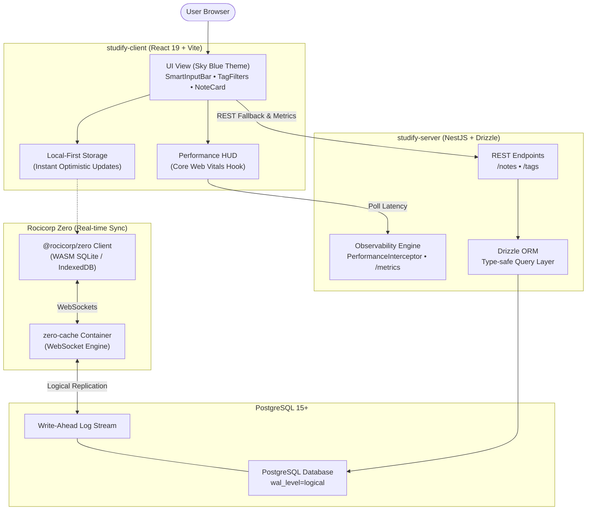

# Studify — System Architecture & Engineering Specifications

This document outlines the end-to-end architecture of **Studify**, detailing data flows, component boundaries, database schemas, and observability infrastructure.

---

## 1. High-Level Architecture Diagram

---

## 2. Relational Database Schema (Drizzle ORM)

### `notes` Table
| Column | Type | Constraints | Description |
| :--- | :--- | :--- | :--- |
| `id` | `text` | `PRIMARY KEY` | Unique ID (UUID or nanoid) |
| `content` | `text` | `NOT NULL` | The note, definition, or comparison text |
| `category` | `text` | `DEFAULT 'note'` | `'definition'`, `'comparison'`, or `'note'` |
| `created_at` | `timestamptz` | `DEFAULT now()` | Timestamp when note was created |
| `updated_at` | `timestamptz` | `DEFAULT now()` | Timestamp when note was last modified |

### `tags` Table
| Column | Type | Constraints | Description |
| :--- | :--- | :--- | :--- |
| `id` | `text` | `PRIMARY KEY` | Unique tag ID |
| `name` | `text` | `UNIQUE NOT NULL` | Tag name (e.g. `'frontend'`, `'devops'`) |
| `created_at` | `timestamptz` | `DEFAULT now()` | Timestamp when tag was created |

### `note_tags` Table (Junction Table)
| Column | Type | Constraints | Description |
| :--- | :--- | :--- | :--- |
| `id` | `text` | `PRIMARY KEY` | Composite key string (`${noteId}_${tagId}`) |
| `note_id` | `text` | `REFERENCES notes(id) ON DELETE CASCADE` | Associated note |
| `tag_id` | `text` | `REFERENCES tags(id) ON DELETE CASCADE` | Associated tag |
| `created_at` | `timestamptz` | `DEFAULT now()` | Creation timestamp |

---

## 3. Backend API Specifications (NestJS)

- **`POST /notes`**: Creates a note, parses tag names, auto-creates non-existent tags, links them via `note_tags`, and returns the note with attached tags.
- **`GET /notes?tags=frontend,web&search=query`**: Retrieves notes with their tags, supporting filtering by single/multiple tags and full-text search.
- **`GET /notes/:id`**: Retrieves a single note with its tags.
- **`DELETE /notes/:id`**: Deletes a note and cascades deletion of its junction records.
- **`GET /tags`**: Returns all available tags.
- **`GET /metrics`**: Returns real-time server health, memory consumption (`rss`, `heapUsed`), rolling latency percentiles (`avg`, `p50`, `p95`, `p99`), and recent request logs.

---

## 4. Observability & Performance Pipeline

### Backend
- **`PerformanceInterceptor`**: Calculates total request execution time using `performance.now()`.
- **`Server-Timing` Header**: Attaches `Server-Timing: app;dur=X` to all HTTP responses so browser DevTools can inspect backend processing time directly in network waterfalls.

### Frontend
- **Google `web-vitals`**: Hooks monitor real user performance (RUM):
  - **LCP** (Largest Contentful Paint)
  - **INP** (Interaction to Next Paint)
  - **CLS** (Cumulative Layout Shift)
  - **FCP** (First Contentful Paint)
  - **TTFB** (Time to First Byte)
- **Dev HUD Overlay**: Displays live status in the corner of the application with Google Good/Needs-Improvement/Poor thresholds.

---

## 5. Design System & Tokens (Sky Blue Theme)

Guided by Anthropic's `frontend-design` instructions to create an intentional, calm, and distinctive interface:
- **Light Theme**: Morning crisp sky (`#f4f9fd` background, pure white elevated cards, `#0284c7` primary blue).
- **Dark Theme**: Twilight deep navy sky (`#080f1e` background, `#0f1b33` surface, `#38bdf8` luminescent cyan).
- **Typography**: Google Fonts `Plus Jakarta Sans` for clean legibility and `JetBrains Mono` for tags, badges, and metrics.
